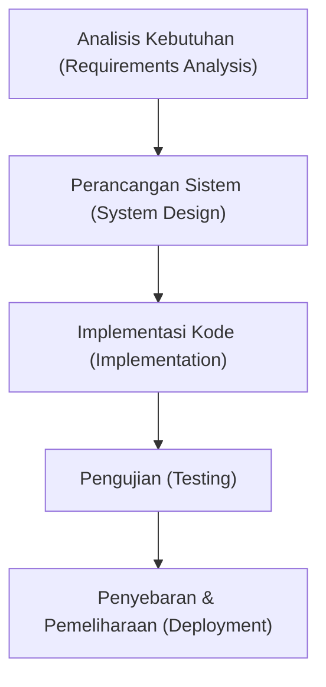

# Panduan Informasi Proyek SIAKAD SMA untuk Penulisan Jurnal Ilmiah

Dokumen ini disusun untuk membantu Anda menulis jurnal ilmiah, paper, atau laporan penelitian mengenai pengembangan **Sistem Informasi Akademik Sekolah Menengah Atas (SIAKAD SMA)**. Dokumen ini menyajikan aspek teoretis, arsitektur sistem, skema database, algoritma penting, hingga analisis fungsional yang dapat langsung diadaptasi ke dalam struktur penulisan jurnal Anda.

---

## 1. Metadata Proyek (Identitas Sistem)

| Komponen | Spesifikasi / Keterangan |
| --- | --- |
| **Nama Proyek** | SIAKAD SMA (Sistem Informasi Akademik Sekolah Menengah Atas) |
| **Aktor Utama (Roles)** | 1. Admin / Tata Usaha (TU)<br>2. Guru (Pengajar & Wali Kelas)<br>3. Siswa |
| **Framework Backend** | Laravel v13.x |
| **Framework Frontend** | Blade Templates + Tailwind CSS v4 |
| **Build Tool & Bundler** | Vite |
| **Database Engine** | SQLite (Default / Development) & MySQL (Production-ready) |
| **Pustaka Hak Akses** | Spatie Laravel-Permission v8.0 (Dynamic RBAC) |
| **Pustaka PDF** | Barryvdh Laravel-DomPDF v3.1 |
| **Pustaka Import/Export** | Maatwebsite Excel v3.1 |
| **Bahasa Pemrograman** | PHP 8.3.x & JavaScript |

---

## 2. Abstrak & Pendahuluan (Draf Konten Jurnal)

### Latar Belakang Masalah
Di tingkat Sekolah Menengah Atas (SMA), pengelolaan data akademik seperti data siswa, penjadwalan kelas, rekapitulasi kehadiran, hingga pengolahan nilai rapor sering kali masih dilakukan secara manual menggunakan lembar kerja terpisah (*spreadsheet*) atau buku catatan fisik. Beberapa masalah utama yang diidentifikasi meliputi:
1. **Kerentanan Data**: Duplikasi data siswa dan risiko kehilangan berkas fisik.
2. **Konflik Penjadwalan (*Schedule Clashing*)**: Kesulitan merancang jadwal mingguan karena potensi guru dijadwalkan mengajar di dua kelas berbeda pada waktu yang sama.
3. **Beban Administrasi Guru**: Pengisian absensi kertas dan kalkulasi nilai akhir siswa secara manual menyita waktu yang cukup besar (bisa memakan waktu 1-2 minggu di akhir semester).
4. **Keterbatasan Transparansi**: Siswa dan orang tua tidak dapat memantau kehadiran serta nilai secara langsung, melainkan harus menunggu pembagian e-Rapor fisik di akhir semester.

### Solusi yang Diusulkan
Pengembangan aplikasi **SIAKAD SMA** berbasis web terintegrasi dengan arsitektur monolitik menggunakan Laravel 13, Tailwind CSS v4, dan database SQLite/MySQL. Sistem ini mengintegrasikan seluruh administrasi sekolah dalam satu platform, dilengkapi fitur **Pencegah Tabrakan Jadwal Otomatis (Clashing Prevention)** untuk guru, pengolahan nilai terbobot otomatis berdasarkan Kurikulum Merdeka, serta ekspor e-Rapor berformat PDF secara langsung.

---

## 3. Metodologi Penelitian & Pengembangan (R&D)

Dalam jurnal ilmiah, Anda dapat menggunakan metodologi **Software Development Life Cycle (SDLC)** dengan model **Waterfall** atau **Agile/Scrum**. Contoh deskripsi tahapan (menggunakan Waterfall):



1. **Analisis Kebutuhan**: Mengidentifikasi proses bisnis di sekolah (pembagian kelas, penjadwalan, absensi per sesi, pengolahan nilai, cetak rapor).
2. **Perancangan Sistem**: Merancang Entity Relationship Diagram (ERD), Use Case Diagram, serta arsitektur data.
3. **Implementasi**: Penulisan kode program menggunakan framework PHP Laravel, menerapkan pola MVC (Model-View-Controller).
4. **Pengujian**: Melakukan pengujian fungsionalitas menggunakan metode *Black-Box Testing* serta verifikasi logika bisnis (seperti pengecekan tabrakan jadwal).

---

## 4. Analisis & Perancangan Sistem

### 4.1. Analisis Aktor & Hak Akses (Use Case Summary)
Sistem ini menggunakan **Dynamic Role-Based Access Control (RBAC)** melalui pustaka `spatie/laravel-permission`. Relasi dinamis antara *User*, *Role*, dan *Permission* disimpan langsung di database, sehingga admin dapat memodifikasi hak akses tanpa mengubah baris kode.

```
                  ┌──────────────────────────────────────────────┐
                  │                 SIAKAD SMA                   │
                  ├──────────────────────────────────────────────┤
                  │                                              │
 ┌──────────┐     │  ┌────────────────────────┐                  │
 │          ├─────┼──►  Manajemen Data Master │                  │
 │ Admin TU ├─────┼──►  Atur Jadwal & Kelas   │                  │
 │          ├─────┼──►  Finalisasi Nilai Rapor│                  │
 └──────────┘     │  └────────────────────────┘                  │
                  │                                              │
                  │  ┌────────────────────────┐                  │
 ┌──────────┐     │  │  Input Absensi Harian  ◄──────────────────┤    ┌──────────┐
 │   Guru   ├─────┼──►  Input Nilai & Deskrip ◄──────────────────┼────┤  Siswa   │
 └──────────┘     │  │  Cetak Rapor Perwalian │                  │    └──────────┘
                  │  └────────────────────────┘                  │
                  │                                              │
                  │  ┌────────────────────────┐                  │
                  │  │  Lihat Jadwal & Rapor  ◄──────────────────┤
                  │  └────────────────────────┘                  │
                  │                                              │
                  └──────────────────────────────────────────────┘
```

*   **Admin TU (Super-admin)**: Memiliki hak penuh untuk mengelola data master, membuat jadwal, mengatur hak akses, dan mengunci nilai rapor.
*   **Guru**:
    *   *Guru Mata Pelajaran*: Mengisi kehadiran siswa pada jam pelajarannya, memasukkan nilai tugas/kuis, UTS, dan UAS untuk mata pelajaran yang diampunya.
    *   *Wali Kelas*: Memiliki hak tambahan untuk meninjau peringkat kelas perwalian, melihat grafik pencapaian nilai rata-rata kelas, mengisi catatan wali kelas, dan mengunduh e-Rapor PDF siswanya.
*   **Siswa**: Mengakses jadwal pelajaran pribadi secara dinamis, melihat persentase kehadiran kumulatif, serta mengunduh e-Rapor PDF setelah dipublikasikan oleh Admin.

---

## 5. Perancangan Database (Entity Relationship & Skema Migrasi)

Berikut adalah ringkasan skema tabel basis data utama yang dirancang untuk mendukung operasional sistem:

### 5.1. Struktur Tabel Utama
1.  **`users`**: Menyimpan kredensial login (email, password, foto profil, dan status status akun).
2.  **`tahun_ajarans`**: Mengelola periode aktif akademik (misal: "2025/2026 Ganjil") dengan status `is_aktif` (boolean) untuk mengontrol lingkup data yang ditampilkan secara global.
3.  **`jurusans`** & **`kelas`**: Menampung data program studi (IPA, IPS, dll.) serta pembagian kelas yang terikat pada Tahun Ajaran tertentu.
4.  **`gurus`** & **`siswas`**: Profil lengkap pendidik (memuat NIP, NUPTK) dan siswa (memuat NIS, NISN) yang berelasi 1-to-1 dengan tabel `users`.
5.  **`mata_pelajarans`**: Menyimpan daftar mata pelajaran beserta nilai Kriteria Ketuntasan Minimal (KKM).
6.  **`jadwal_pelajarans`**: Menghubungkan kelas, mata pelajaran, guru pengampu, hari, jam mulai, jam selesai, dan urutan jam.
7.  **`absensis`** & **`detail_absensis`**: Menyimpan data kehadiran per sesi kelas di tanggal tertentu dengan status enum `['hadir', 'sakit', 'izin', 'alpa']`.
8.  **`bobot_nilais`**: Mengatur persentase pembobotan nilai (Harian, UTS, UAS) yang bersifat fleksibel per kelas atau mata pelajaran.
9.  **`nilais`** & **`detail_nilais`**: Menyimpan rangkuman nilai akhir, deskripsi kompetensi, status finalisasi (`is_final`), serta riwayat nilai harian (kuis, tugas, ulangan harian).

### 5.2. Relasi Database (Skema Relasional Konseptual)
Relasi kunci yang dibangun dalam migrasi basis data adalah sebagai berikut:

```
[tahun_ajarans] 1 ──── ∞ [kelas] 1 ──── ∞ [jadwal_pelajarans]
                            │                     │
                            │ 1                   │ 1
                            ▼                     ▼
[siswas] ∞ ────────────── 1 [kelas]            [absensis] 1 ─── ∞ [detail_absensis]
    │                                                                   │
    └───────────────────────────────────────────────────────── ∞ ───────┘
```

---

## 6. Algoritma & Formula Penting (Bahan Utama Jurnal)

Dua inovasi fungsional utama dalam kode aplikasi SIAKAD SMA yang sangat direkomendasikan untuk dibahas dalam bab **Hasil dan Pembahasan** jurnal Anda adalah logika pencegah tabrakan jadwal dan kalkulasi nilai terbobot dinamis.

### 6.1. Algoritma Deteksi & Pencegahan Konflik Jadwal (Conflict Prevention)
Aplikasi memastikan tidak ada guru yang dijadwalkan mengajar pada hari dan jam yang sama di kelas yang berbeda. Menggunakan konsep matematika irisan interval waktu:
*   Misal jadwal eksisting memiliki rentang waktu $[T_{start1}, T_{end1}]$ dan jadwal baru yang diinput memiliki rentang $[T_{start2}, T_{end2}]$.
*   Dua rentang waktu bertumpang tindih (overlap) jika dan hanya jika:
    $$T_{start1} < T_{end2} \quad \text{dan} \quad T_{end1} > T_{start2}$$

Diimplementasikan pada [JadwalPelajaran.php](file:///d:/Pribadi/Kuliah/Semester_6/APL/siakad-sma/app/Models/JadwalPelajaran.php#L50-L72) sebagai berikut:

```php
public static function cekKonflikGuru(
    int $guruId,
    string $hari,
    string $jamMulai,
    string $jamSelesai,
    int $tahunAjaranId,
    ?int $excludeId = null
): bool {
    $query = self::where('guru_id', $guruId)
        ->where('hari', $hari)
        ->where('tahun_ajaran_id', $tahunAjaranId)
        ->where(function ($q) use ($jamMulai, $jamSelesai) {
            // Logika Overlap Waktu
            $q->where('jam_mulai', '<', $jamSelesai)
              ->where('jam_selesai', '>', $jamMulai);
        });

    if ($excludeId) {
        $query->where('id', '!=', $excludeId);
    }

    return $query->exists();
}
```

### 6.2. Formula Kalkulasi Nilai Akhir & Normalisasi Dinamis
Sistem menghitung nilai akhir ($NA$) berdasarkan bobot persentase dari Rata-rata Nilai Harian ($R_H$), Nilai UTS ($N_{UTS}$), dan Nilai UAS ($N_{UAS}$).

Rumus dasar pengolahan nilai:
$$NA = \left( R_H \times \frac{B_H}{100} \right) + \left( N_{UTS} \times \frac{B_{UTS}}{100} \right) + \left( N_{UAS} \times \frac{B_{UAS}}{100} \right)$$

Di mana:
*   $B_H$: Bobot Harian (Default: $40\%$)
*   $B_{UTS}$: Bobot UTS (Default: $30\%$)
*   $B_{UAS}$: Bobot UAS (Default: $30\%$)

**Kasus Normalisasi Dinamis**:
Apabila salah satu komponen nilai belum diisi (misalnya UTS atau UAS belum berlangsung), nilai akhir tetap dihitung secara proporsional agar guru dan siswa mendapatkan estimasi nilai saat ini tanpa terdistorsi menjadi sangat kecil. Sistem melakukan normalisasi pembagi berdasarkan total bobot komponen yang terisi ($TB$):
$$TB = B_{\text{komponen terisi}}$$
$$NA_{\text{normalisasi}} = \frac{NA_{\text{sementara}}}{TB} \times 100$$

Logika diimplementasikan pada [Nilai.php](file:///d:/Pribadi/Kuliah/Semester_6/APL/siakad-sma/app/Models/Nilai.php#L76-L119):

```php
public function hitungNilaiAkhir(): void
{
    // Hitung rata-rata harian dari detail nilai
    $detailHarian = $this->detailNilais()->avg('nilai');
    $this->rata_rata_harian = $detailHarian ?? $this->rata_rata_harian;

    // Ambil bobot (fallback default 40% - 30% - 30%)
    $bobot = BobotNilai::where('mata_pelajaran_id', $this->mata_pelajaran_id)
        ->where('tahun_ajaran_id', $this->tahun_ajaran_id)
        ->first();

    $bobotHarian = $bobot ? $bobot->bobot_harian : 40;
    $bobotUts = $bobot ? $bobot->bobot_uts : 30;
    $bobotUas = $bobot ? $bobot->bobot_uas : 30;

    $nilaiAkhir = 0;
    $totalBobot = 0;

    if ($this->rata_rata_harian !== null) {
        $nilaiAkhir += ($this->rata_rata_harian * $bobotHarian / 100);
        $totalBobot += $bobotHarian;
    }
    if ($this->nilai_uts !== null) {
        $nilaiAkhir += ($this->nilai_uts * $bobotUts / 100);
        $totalBobot += $bobotUts;
    }
    if ($this->nilai_uas !== null) {
        $nilaiAkhir += ($this->nilai_uas * $bobotUas / 100);
        $totalBobot += $bobotUas;
    }

    // Normalisasi jika komponen nilai belum lengkap
    if ($totalBobot > 0 && $totalBobot < 100) {
        $nilaiAkhir = ($nilaiAkhir / $totalBobot) * 100;
    }

    $this->nilai_akhir = round($nilaiAkhir, 2);
    $this->save();
}
```

---

## 7. Hasil Pengujian Fungsional (Draf Tabel Uji)

Tabel berikut menyajikan contoh skenario pengujian fungsional aplikasi (Black-Box Testing) yang dapat dimasukkan ke dalam bab **Hasil dan Pembahasan** di jurnal Anda:

| ID Uji | Fitur | Skenario Uji | Hasil yang Diharapkan | Status |
| --- | --- | --- | --- | :---: |
| **UT-01** | Autentikasi | Login dengan email dan password yang sesuai. | Masuk ke dashboard sesuai dengan hak akses (Role). | Berhasil |
| **UT-02** | RBAC Dinamis | Membuka halaman manajemen data master dengan akun Siswa. | Sistem memblokir akses dan mengembalikan error HTTP 403. | Berhasil |
| **UT-03** | Konflik Jadwal | Menambahkan jadwal guru pada waktu mengajar yang sama di kelas lain. | Pengisian ditolak, sistem menampilkan pesan error tabrakan jadwal. | Berhasil |
| **UT-04** | Kalkulasi Nilai | Mengisi nilai Tugas 1 (80), Kuis (90), UTS (80), UAS (75). | Sistem otomatis menghitung Rata-rata Harian dan Nilai Akhir terbobot. | Berhasil |
| **UT-05** | e-Rapor PDF | Mengunduh berkas rapor digital milik siswa aktif. | Menghasilkan dokumen PDF terformat rapi berisi daftar nilai akademik. | Berhasil |

---

## 8. Kesimpulan & Manfaat Penelitian

1.  **Peningkatan Efisiensi**: Sistem memangkas waktu rekapitulasi data akademik sekolah secara masif (dari 14 hari menjadi kurang dari 3 hari kerja).
2.  **Validitas Data Akademik**: Melalui validasi database yang ketat dan kalkulasi otomatis, potensi kesalahan input atau manipulasi nilai dapat diminimalisasi.
3.  **Pengurangan Konflik Operasional**: Algoritma deteksi tabrakan waktu mengajar memfasilitasi pembuatan jadwal secara aman dan akurat pada awal tahun ajaran.
4.  **Transparansi Informasi**: Integrasi hak akses memberikan keleluasaan bagi siswa untuk memantau kehadiran dan perkembangan belajar secara mandiri.

---
*Dokumen ini dirancang sebagai kerangka teknis dasar. Anda dapat menyesuaikan teori pendukung, sitasi jurnal eksternal, dan data uji coba riil berdasarkan kebutuhan penulisan jurnal ilmiah Anda.*
